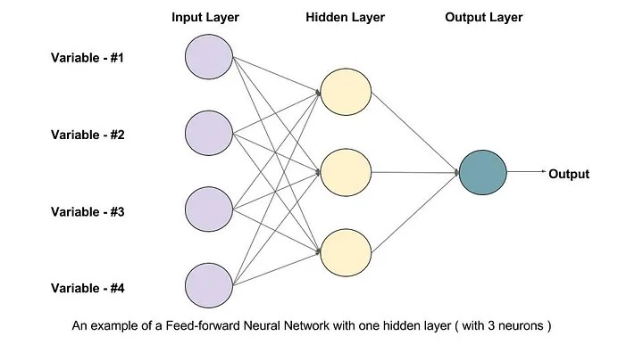
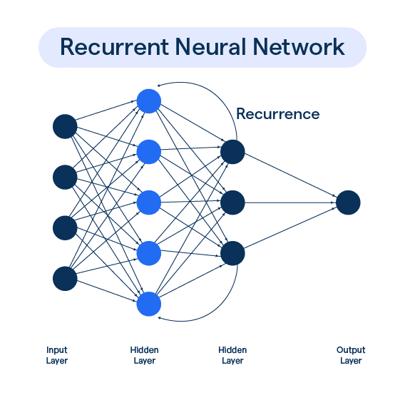

# Text Classification with FFNN and RNN

This repository contains the implementation of a text classification system using two different neural network architectures: a Feedforward Neural Network (FFNN) and a Recurrent Neural Network (RNN). The models are trained to classify text data (e.g., reviews) into one of five categories based on the sentiment (represented by star ratings).

## Table of Contents

- [How the Models Work](#how-the-models-work)
  - [Feedforward Neural Network (FFNN)](#1-feedforward-neural-network-ffnn)
  - [Recurrent Neural Network (RNN)](#2-recurrent-neural-network-rnn)
- [Mathematical Background](#mathematical-background)
  - [Feedforward Neural Network (FFNN)](#feedforward-neural-network-ffnn)
  - [Recurrent Neural Network (RNN)](#recurrent-neural-network-rnn)
- [Installation](#installation)
- [Usage](#usage)
- [Training Process](#training-process)
- [Learning Curve](#learning-curve)
- [Contributing](#contributing)

## How the Models Work

### 1. Feedforward Neural Network (FFNN)

#### Overview
A Feedforward Neural Network (FFNN) is one of the simplest types of neural networks where the information flows in one direction—from the input layer to the output layer, passing through one or more hidden layers. There are no cycles or loops in the network.



#### Key Components
- **Input Layer:** Converts the input data (e.g., word embeddings) into a vector representation.
- **Hidden Layers:** Applies linear transformations followed by non-linear activation functions to capture the complex relationships in the data.
- **Output Layer:** Produces a probability distribution over the possible output classes using a softmax function.

### 2. Recurrent Neural Network (RNN)




#### Overview
Recurrent Neural Networks **(RNNs)** are designed to handle sequential data by maintaining a hidden state that captures information from previous time steps. This makes RNNs well-suited for tasks where the order of input data is important, such as text classification.

#### Key Components
- **Input Layer:** Takes the input at each time step (e.g., word embeddings for each word in a sentence).
- **Recurrent Layer:** Maintains a hidden state that is updated at each time step based on the current input and the previous hidden state.
- **Output Layer:** Similar to FFNN, the output layer produces a probability distribution over classes.

## Mathematical Background

### Feedforward Neural Network (FFNN)

Let $\mathbf{x}$ be the input feature vector, and $\mathbf{y}$ be the output vector. The FFNN model computes the output as follows:

1. **Linear Transformation:**

   $$\mathbf{h} = \sigma(\mathbf{W}_1 \mathbf{x} + \mathbf{b}_1)$$
   
   where $\mathbf{W}_1$ is the weight matrix, $\mathbf{b}_1$ is the bias vector, and $\sigma$ is the activation function (e.g., ReLU).

3. **Output Calculation:**
   
   $$\mathbf{y} = \text{softmax}(\mathbf{W}_2 \mathbf{h} + \mathbf{b}_2)$$
   
   where $\mathbf{W}_2$ and $\mathbf{b}_2$ are the weight matrix and bias vector for the output layer.

4. **Loss Function:**
   The model is trained by minimizing the cross-entropy loss:
   
   $$\mathcal{L}(\mathbf{y}, \mathbf{\hat{y}}) = - \sum_{i=1}^{C} \hat{y}_i \log(y_i)$$
   
   where $C$ is the number of classes, $\hat{y}_i$ is the true label, and $y_i$ is the predicted probability.

### Recurrent Neural Network (RNN)

Let $\mathbf{x}_t$ be the input at time step $t$ and $\mathbf{h}_t$ be the hidden state at time step $t$. The RNN model computes the output as follows:

1. **Hidden State Update:**
   
   
   $$\mathbf{h}_t = \sigma\(\mathbf{W}_{xh} \mathbf{x}_t + \mathbf{W}_{hh} \mathbf{h}_{t-1} + \mathbf{b}_h\)$$
   

   where \mathbf{W}_{xh} is the input-to-hidden weight matrix, $\mathbf{W}_{hh}$ is the hidden-to-hidden weight matrix, and $\mathbf{b}_h$ is the bias vector.

3. **Output Calculation:**

   
  $$ \mathbf{y} = \text{softmax}(\mathbf{W}_y \mathbf{h}_T + \mathbf{b}_y)$$

   
   where $T$ is the final time step, $\mathbf{W}_y$ is the hidden-to-output weight matrix, and $\mathbf{b}_y$ is the output bias vector.

3. **Loss Function:**
   The model uses cross-entropy loss similar to the FFNN.

## Installation

To set up the project, clone this repository and install the required Python packages using pip:

```bash
git clone https://github.com/your-username/text-classification.git
cd text-classification
pip install -r requirements.txt
```

## Usage

To train the models, run the following command:

```bash
python main.py --hidden_dim 128 --epochs 10 --train_data path/to/train.json --val_data path/to/val.json --do_train
```

Replace `path/to/train.json` and `path/to/val.json` with the actual paths to your training and validation data.

## Training Process

The training process involves feeding the input text data through the models, computing the loss, and updating the model weights using backpropagation. The models will be trained for a specified number of epochs, and both training and validation accuracies will be reported at the end of each epoch.

## Learning Curve

The learning curve shows the training and validation accuracy over each epoch. It helps in understanding how well the model is learning and if there is any overfitting.

To visualize the learning curve, use the provided script to plot the accuracy metrics:

```python
import matplotlib.pyplot as plt

# Define the training and validation accuracy for each epoch
training_accuracy = [0.530125, 0.58475, 0.618125, 0.642875, 0.66575]
validation_accuracy = [0.02875, 0.03625, 0.1025, 0.06625, 0.04625]

# Define the epochs
epochs = range(1, 6)

# Create the plot
plt.figure(figsize=(10,5))
plt.plot(epochs, training_accuracy, 'bo-', label='Training Accuracy')
plt.plot(epochs, validation_accuracy, 'ro-', label='Validation Accuracy')

# Add titles and labels
plt.title('Learning Curve for FFNN and RNN Models')
plt.xlabel('Epochs')
plt.ylabel('Accuracy')
plt.legend()

# Show the plot
plt.grid(True)
plt.show()
```

## Contributing

Contributions are welcome! Please submit a pull request or open an issue to discuss your ideas.

